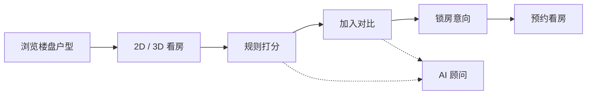
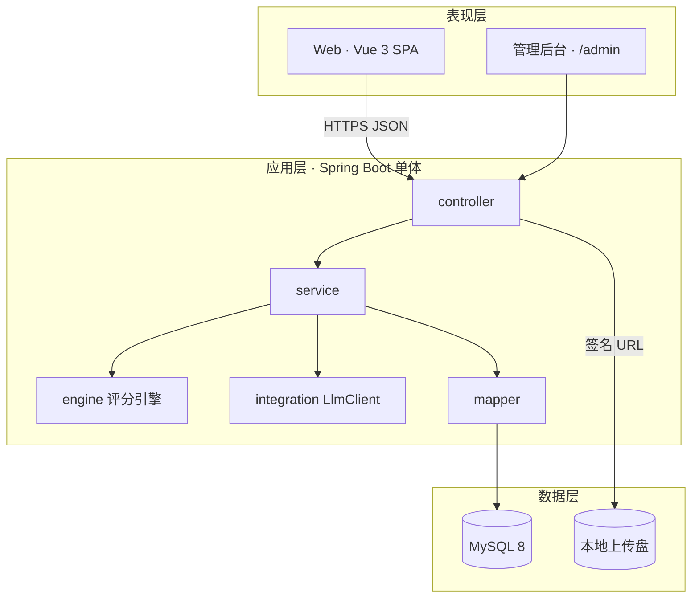

<div align="center">

# 肇庆 · 好房子

**在线选房与户型智能评估系统**

软件工程课程设计 · 课题十一  
规格先行 · 代码与文档同源 · 评估结果可解释

[功能](#-功能) · [技术栈](#-技术栈) · [快速开始](#-快速开始) · [架构](#-系统架构) · [规格驱动](#-规格驱动开发)

[](https://openjdk.org/)
[](https://spring.io/projects/spring-boot)
[](https://vuejs.org/)
[](https://www.mysql.com/)
[](#)

</div>

---

面向购房者、置业顾问与管理员的选房演示系统：从户型 2D / 3D 浏览、规则打分、多户型对比，到锁房意向与预约看房，全程可演示。评分不是黑盒分数，每条结果都能追溯到规则、指标与证据。

| 购房者 | 顾问 / 管理员 | 答辩演示 |
| :---: | :---: | :---: |
| 筛选户型 · 看图打分 · 对比收藏 | 规则维护 · 预约审批 · 销控 | 种子数据开箱即用 · 断网可走 Mock AI |

---

## 功能

题目五大模块 + 四个 AI 创新点，按功能域拆分：

| 域 | 能力 | 创新 |
| --- | --- | --- |
| **001 用户与画像** | 注册登录、角色隔离、偏好画像 | 顾问推荐的输入源 |
| **002 户型展示** | Canvas 2D 户型图、Three.js 3D、几何标注联动 | AI 生成 3D 初始化代码 |
| **003 在线选房** | 楼盘筛选、收藏、模拟选房、10 分钟锁房 | — |
| **004 规则打分** | 采光 / 通风 / 动线等可解释评分，雷达图 + 明细证据 | AI 生成评估规则与动态权重 |
| **005 对比报告** | 多户型矩阵对比、优劣标注、分享链接 | AI 生成对比结论与选房建议 |
| **006 预约看房** | 时段余量、预约状态机、提醒 | — |
| **007 AI 顾问** | 规则草案 / 报告结论 / 智能选房，统一网关 | 超时、重试、Mock 降级 |

主路径：**筛选 → 看户型 → 出评分**，新用户约 3 分钟走完。



---

## 技术栈

| 层 | 选型 | 说明 |
| --- | --- | --- |
| 前端 | Vue 3 · Vite · TypeScript · Pinia · Element Plus | SPA，购房者与后台同一应用、路由隔离 |
| 图形 | Canvas 2D · Three.js · ECharts | 户型图、3D 盒体 / GLB、雷达图 |
| 后端 | Java 17 · Spring Boot 3.2 · Spring Security | 单体分域，不做微服务 |
| 数据 | MyBatis-Plus · SQLite | 本地一个文件即可跑；`database/schema.sql` 保留 MySQL 设计稿 |
| 规则 | 自研 JSON 打分 DSL | 规则外置，改权重不必改代码 |
| AI | 通义千问 OpenAI 兼容接口 | 8s 超时 + 1 次重试 + Mock 兜底 |
| 契约 | OpenAPI 3 · JSON Schema · Mermaid | spec / 代码 / 报告同源 |

**明确不做**：微服务、消息队列、K8s、真实支付、网签对接、自研三维引擎。

---

## 快速开始

种子数据含 **3 个楼盘 / 20 个户型 / 600 套房源 / 规则 v1.0**。无大模型密钥时把 `LLM_ENABLED` 设为 `false`，AI 走模板结果，答辩仍可演示。

### 方式一：Docker 一键起（推荐答辩）

需要 Docker Desktop。

```bash
cp backend/.env.example backend/.env
# 可选：填入 LLM_API_KEY；离线演示设 LLM_ENABLED=false

docker compose up -d --build
```

| 服务 | 地址 |
| --- | --- |
| 前端 | http://localhost:3000 |
| 后端 API | http://localhost:8080 |
| Swagger | http://localhost:8080/doc.html |

### 方式二：本地分服务启动

环境：JDK 17、Maven 3.9、Node 20。数据库用 SQLite，第一次启动后端会在 `backend/data/haofangzi.db` 建表并灌入种子，不用单独装 MySQL。`database/schema.sql` 仍是课程里的 MySQL 物理设计说明。

```bash
# 1. 后端  →  http://localhost:8080
cd backend
cp .env.example .env
mvn spring-boot:run

# 2. 前端  →  http://localhost:5173  （Vite 已代理 /api）
cd frontend
pnpm i && pnpm dev
```

### 演示账号

| 角色 | 账号 | 密码 |
| --- | --- | --- |
| 购房者 | `13800000001` | `Test@123` |
| 顾问 / 管理员 | `admin` | `Test@123` |

---

## 系统架构



后端包结构与 `specs/` 一一对应：

```
com.zhq.haofangzi
├── common/        统一响应、错误码、脱敏
├── config/        Security / JWT / OpenAPI
├── controller/    认证、户型、选房、评分、预约、AI
├── service/       用例编排与事务
├── domain/        entity · dto · enums
├── engine/        规则装载 → 指标计算 → 加权打分 → 解释
├── mapper/        MyBatis-Plus
└── integration/   LlmClient · Mock 降级
```

---

## 仓库结构

```
haofangzi/
├── constitution.md          项目宪法：冲突时以此为准
├── plan.md                  全局技术方案
├── tasks.md                 全局任务清单
├── specs/                   规格层（唯一事实来源）
│   ├── 000-program/         非功能需求、术语、OpenAPI
│   ├── 001-user-auth/       用户与画像
│   ├── 002-layout-display/  户型 2D / 3D
│   ├── 003-house-selection/ 筛选、收藏、锁房
│   ├── 004-rule-scoring/    规则打分引擎
│   ├── 005-compare-report/  对比报告
│   ├── 006-appointment/     预约看房
│   └── 007-ai-advisor/      AI 顾问
├── docs/                    课程设计交付文档与 Mermaid 图
├── database/                schema.sql · seed-data.sql
├── backend/                 Spring Boot 骨架（评分引擎已可跑）
├── frontend/                Vue 3 骨架
└── docker-compose.yml       答辩现场一键编排
```

每个功能域目录约定：

| 文件 | 回答什么 |
| --- | --- |
| `spec.md` | WHAT / WHY：用户故事、FR、验收标准 |
| `plan.md` | HOW：模块、算法、改动面 |
| `tasks.md` | 1～4 小时可执行任务 |
| `contracts/` | API / JSON Schema，先于代码合并 |

报告文档在 [`docs/`](./docs/00-ROADMAP.md)：可行性、需求分析（含 DFD）、概要设计、详细设计、用户手册、测试计划。

---

## 规格驱动开发

协作顺序固定，禁止跳步写代码：

```
宪法 → specify → plan → tasks → implement → 回写 docs
```

| 阶段 | 产出 | 门禁 |
| --- | --- | --- |
| constitution | [`constitution.md`](./constitution.md) | 版本号 + 生效日期 |
| specify | `specs/NNN/spec.md` | 不写表名、框架名等实现细节 |
| plan | 域 `plan.md` + 根 [`plan.md`](./plan.md) | 覆盖全部 FR，不违背宪法 |
| tasks | `tasks.md` | 每任务可追溯到 FR |
| implement | `backend/` `frontend/` | 测试与契约通过 |
| converge | `docs/` | 图表与 spec 版本一致 |

追溯链：`FR / US → 任务号 → 类名 → 测试用例 → 报告章节`。  
仲裁顺序：`constitution.md` → `spec.md` → `plan.md` → 代码。

---

## 实现进度

可直接演示的部分：

- 基础设施：统一 `ApiResponse`、JWT（含一次刷新）、Docker Compose、种子数据
- 登录：注册、图形验证码、短信验证码、失败锁定、画像保存（完整度不足 60% 时顾问不可用）
- 户型展示：列表 / 详情、2D 参数化绘制、3D（GLB 优先，盒体回落）
- 选房：锁房三重并发保护、续期 / 取消 / 转意向、超时回收
- 评分：7 维、规格登记表 25 条指标（概述里写的 21 是登记表的约数）、证据明细。库中有已发布规则时优先用库，否则用 `default-rules.json`
- 对比：服务端矩阵快照、7 天分享链接、浏览器打印（另存 PDF）
- 预约：状态机、容量校验、列表与新建
- AI：硅基流动 `XingChenAGI/Xing4.0-29B`（OpenAI 兼容）。超时或坏 JSON 走模板，分数仍由规则引擎计算
- 管理端：规则草案 / 权重 / 发布、销控改状态与 Excel 导入、用户停用与重置口令。顾问只能操作销控

当前仍未做（见 `docs/00-ROADMAP.md`）：权重灵敏度、顾问「已带看」备注、3D 代码抽屉、AI 调用量看板、全景与户型录入、性能压测。任务勾选以 `tasks.md` 为准，未做的项保持未勾。

---

## 文档索引

| 文档 | 用途 |
| --- | --- |
| [constitution.md](./constitution.md) | 原则、边界、质量门禁 |
| [plan.md](./plan.md) | 选型、分层、跨域约定 |
| [tasks.md](./tasks.md) | 分工与勾选进度 |
| [specs/000-program](./specs/000-program/spec.md) | 术语表、非功能、OpenAPI |
| [database/schema.sql](./database/schema.sql) | 物理库表 |

---

<p align="center">
  <sub>课程设计与演示系统 · 数据均为模拟样例 · 评估结果仅供参考，不构成购房或投资建议</sub>
</p>
