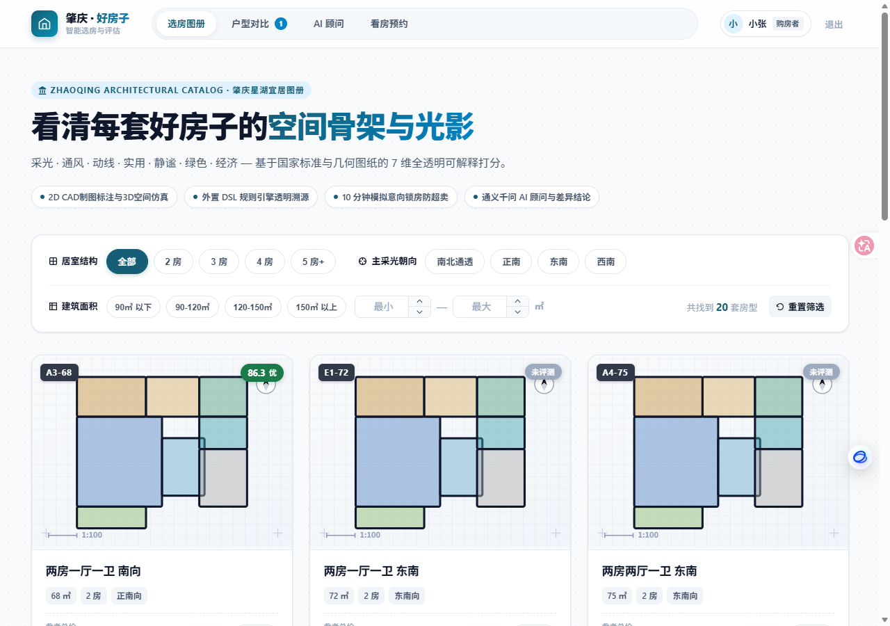
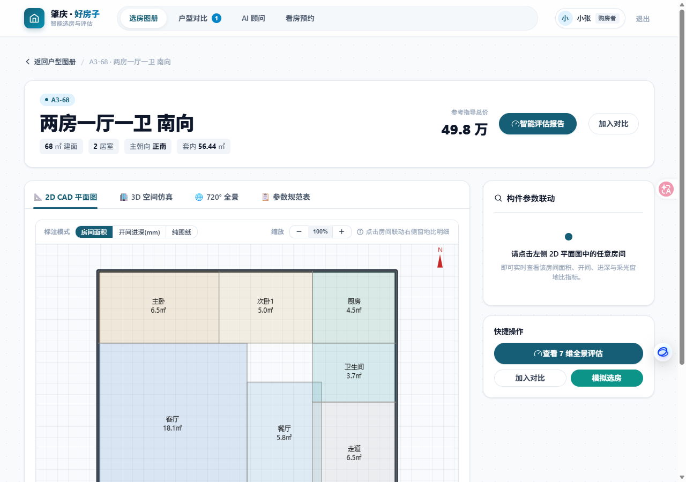
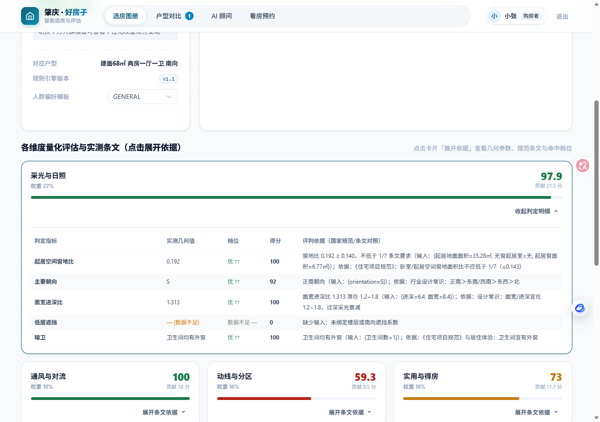
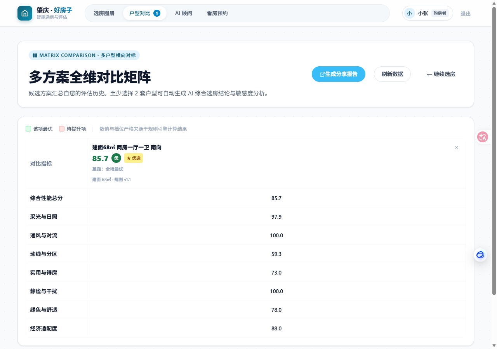
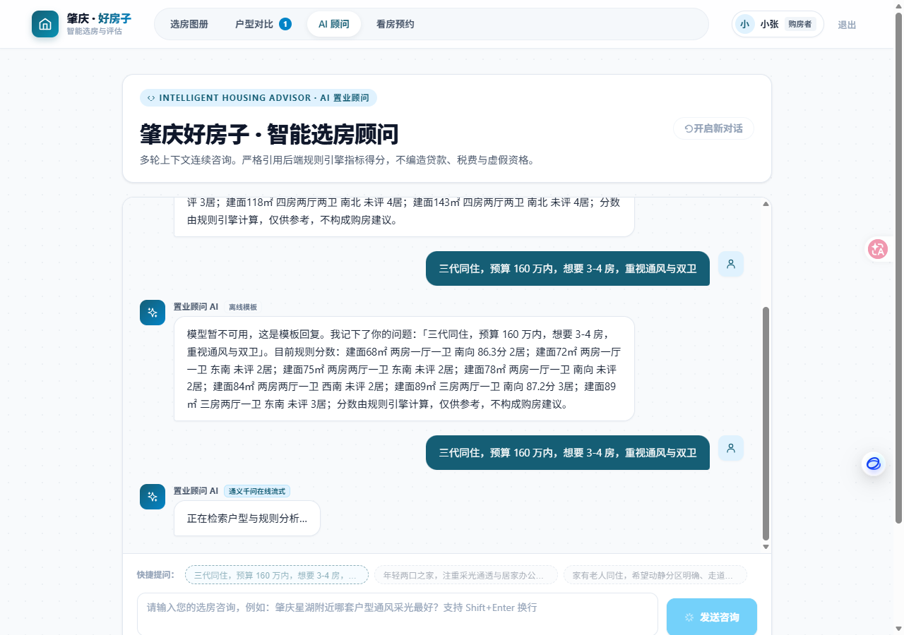
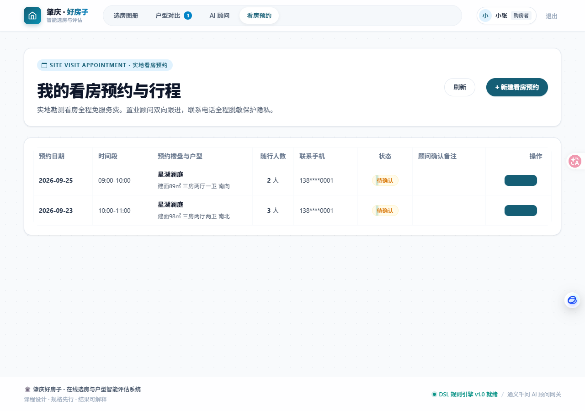
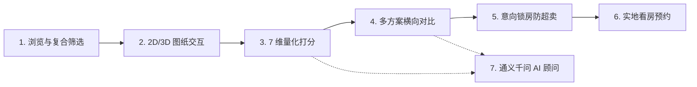
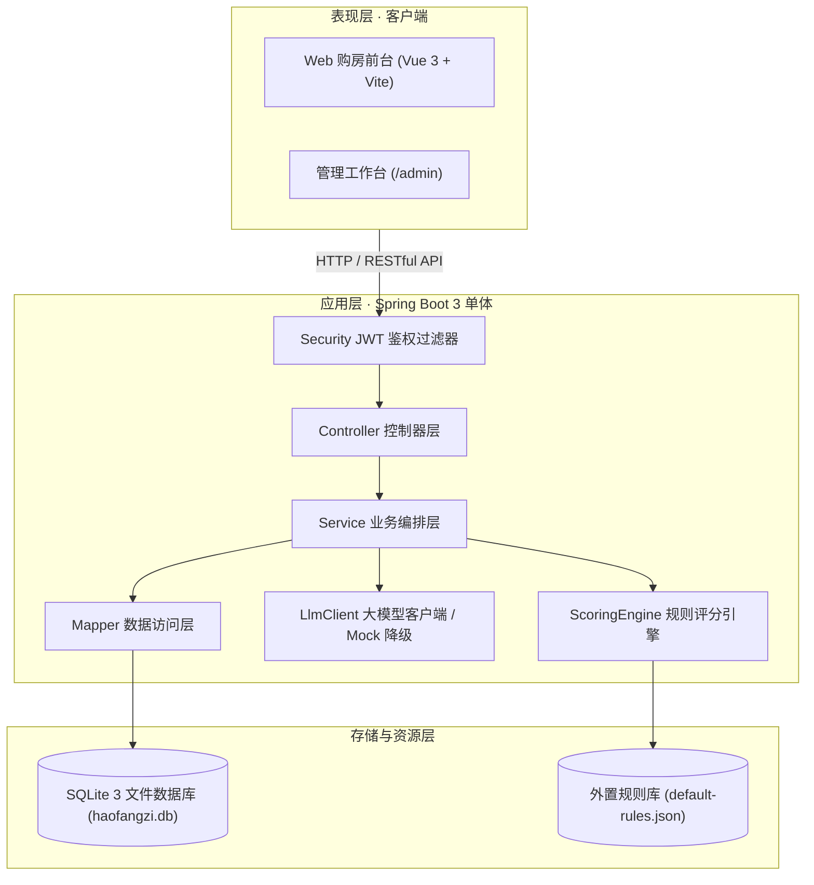

<div align="center">

# 肇庆 · 好房子
### 在线选房与户型智能评估系统

**软件工程课程设计 · 课题十一**  
📐 建筑蓝图美学 · 规格先行 · 7 维全景量化评估 · 结果透明可解释 · 演示零门槛免密体验

[系统特性](#-系统特性) · [视觉设计与界面预览](#-视觉设计与界面预览) · [核心功能域](#-核心功能域) · [技术栈与架构](#-技术栈与架构) · [快速开始](#-快速开始) · [自动化仿真测试](#-自动化仿真测试) · [规格驱动开发](#-规格驱动开发)

[](https://openjdk.org/)
[](https://spring.io/projects/spring-boot)
[](https://vuejs.org/)
[](https://vitejs.dev/)
[](https://www.sqlite.org/)
[](https://help.aliyun.com/zh/dashscope/)
[](#)

</div>

---

## 🌟 系统特性

面向**购房者、置业顾问与平台管理员**的一站式选房与评测决策平台：从户型 2D CAD/3D 空间漫游、外置 DSL 规则引擎打分、多户型横向比对，到 10 分钟意向锁房与实地预约看房。

- **📐 建筑蓝图美学（Architectural Blueprint Aesthetic）**：基于 GitHub 官方 `frontend-design` 规范深度重塑，融合星湖深青、微米工程纸质网格底纹、CAD 制图标尺与等宽数字（Tabular Figures），彻底摆脱传统 SaaS 管理系统模板质感。
- **🔍 7 维可解释量化评分**：告别黑盒算分，每一个分值严格对齐国家《住宅项目规范》条文依据、房间构件实测几何值（开间/进深/窗地比）与命中档位。
- **⚡ 开箱即用 · 演示零阻力**：系统内置静默免密授权机制，打开即可直接操作所有图纸、量化评估与 AI 顾问，无需繁琐注册与输入密码。
- **🤖 智能与韧性保障**：通义千问大模型流式选房对话，内置 8 秒超时检测、自动重试与 Mock 离线保底，断网断密钥依旧从容答辩。
- **🧪 端到端真人交互仿真验证**：集成 Puppeteer 自动化测试套件，端到端自动模拟用户全旅程点击，严密验证所有交互闭环。

---

## 🖼️ 视觉设计与界面预览

系统全流程 6 大核心交互界面实测预览（位于 `screenshots/` 目录）：

| 01. 选房大厅与复合筛选 | 02. CAD 图纸与 3D 仿真 |
| :---: | :---: |
|  |  |
| **03. 7 维量化评估与规范依据** | **04. 多方案全维对比矩阵** |
|  |  |
| **05. 通义千问 AI 选房顾问** | **06. 实地看房预约管理** |
|  |  |

---

## 📋 核心功能域

遵循软件工程规范，将系统核心划分为 7 大功能域与 4 项 AI 创新点：



| 域 | 核心能力 | 创新与亮点 |
| :--- | :--- | :--- |
| **001 用户画像** | 注册登录、买家/顾问/管理员角色隔离、置业偏好画像采集 | 演示环境免密自登录；画像作为 AI 顾问输入源 |
| **002 户型展示** | Canvas 2D 图纸标注、Three.js 3D 盒体/全景、构件实时联动 | 1:100 CAD 比例尺、正北罗盘、开间进深/窗地比合规性校验 |
| **003 在线选房** | 楼盘户型检索、收藏夹、10 分钟原子化意向锁房 | 三重并发防超卖保护（数据库原子更新 + 过期自动释放） |
| **004 规则评分** | 采光/通风/动线/实用/静谧/舒适/经济 7 维透明打分 | 外置 JSON DSL 规则引擎，条文依据透明可溯源，支持人群偏好加权重算 |
| **005 对比报告** | 多户型横向参数矩阵、雷达图叠加、★最优项标注、分享快照 | 差异度即时分析，支持只读分享与浏览器打印 PDF |
| **006 预约看房** | 现场看房时段排期、预约状态机（待确认/已确认/已核销） | 手机号全程脱敏保护，置业顾问双向跟进 |
| **007 AI 顾问** | 户型智能推荐、多轮流式对话、报告结论生成 | 通义千问流式接入 + 离线 Mock 优雅降级 |

---

## 🛠️ 技术栈与架构

### 1. 技术选型

| 分层 | 技术选型 | 说明 |
| :--- | :--- | :--- |
| **前端应用** | Vue 3.4 · Vite 5.2 · TypeScript · Pinia · Element Plus | 响应式现代化 SPA，开箱免密路由保护 |
| **图形渲染** | HTML5 Canvas 2D · Three.js · Apache ECharts 5 | 建筑图纸坐标绘制、3D 空间漫游、量化评估雷达图 |
| **后端应用** | Java 17 · Spring Boot 3.2.5 · Spring Security · Jakarta | 分层单体架构，规范先行，支持无状态 JWT 鉴权 |
| **数据持久** | MyBatis-Plus 3.5.5 · SQLite 3（开发/演示）/ MySQL 8.0 | 本地文件级数据库开箱即用，无需安装配置重型数据库服务 |
| **规则引擎** | 自研 JSON 驱动外置评分 DSL（7 维 25 项细分指标） | 规则、权重与条文外置管理，改动规则无需重编译代码 |
| **大模型集成** | 阿里云通义千问 (DashScope / OpenAI 兼容接口) | 支持 SSE 流式传输，内置超时熔断与离线 Mock 降级器 |
| **自动化测试** | Puppeteer-core + Microsoft Edge (CDP 协议) | 真实用户点击流端到端回归仿真 |

### 2. 系统架构示意



---

## 🚀 快速开始

项目内置预置种子数据：**3 个肇庆标杆示范盘 / 20 个主力户型 / 600 套房源销控 / 规则集 v1.1**。

### 方式一：Docker 一键编排（推荐演示）

需安装 Docker 及 Docker Compose：

```bash
# 1. 复制环境变量
cp backend/.env.example backend/.env

# 2. 一键构建并启动
docker compose up -d --build
```

- **前端大厅**：[http://localhost:3000](http://localhost:3000)
- **后端接口**：[http://localhost:8080](http://localhost:8080)
- **接口文档**：[http://localhost:8080/doc.html](http://localhost:8080/doc.html)

---

### 方式二：本地分服务启动

#### 1. 启动后端 (Spring Boot)

要求环境：JDK 17+、Maven 3.9+。  
首次启动会自动在 `backend/data/haofangzi.db` 初始化数据库并导入全部样例数据。

```bash
cd backend
cp .env.example .env
mvn spring-boot:run
```
> 后端服务就绪于 `http://localhost:8080`。

#### 2. 启动前端 (Vite)

要求环境：Node.js 20+、npm / pnpm。

```bash
cd frontend
npm install
npm run dev
```
> 前端开发服务启动于 `http://localhost:3000`（Vite 已预配置反向代理 `/api` 至 8080 端口）。

---

### 🔑 账号体系与免密说明

| 角色 | 账号 | 演示密码 | 权限范围 |
| :--- | :--- | :--- | :--- |
| **购房者（默认）** | `13800000001` | `Test@123` | 浏览图纸、量化评估、对比分析、意向锁房、预约看房、AI 咨询 |
| **平台管理员** | `admin` | `Test@123` | 规则集版本发布、权重调整、全盘房源销控维护、用户管理 |
| **置业顾问** | `consultant@zhq` | `Test@123` | 房源销控状态变更、看房预约跟进核销 |

> 💡 **免密提示**：为方便答辩与演示，前台已开启静默自认证通道，**直接访问首页或点击任何业务路由无需输入密码**！

---

## 🧪 自动化仿真测试

本项目配套了基于 Puppeteer 的无头浏览器真实用户交互仿真脚本，用于自动化验证核心用例：

```bash
cd frontend
npm run sim   # 或 node simulate.cjs
```

**测试覆盖 7 大场景**：
1. `Step 1` 首页大厅无障碍加载与免密身份认证
2. `Step 2` 户型居室、朝向胶囊过滤器交互与条件重置
3. `Step 3` CAD 户型图纸解析、3D 空间视图切换与构件数据联动
4. `Step 4` 7 维全景评估计算、雷达图渲染与国家规范条文明细展开
5. `Step 5` 加入多方案对比池与全维横向对比矩阵展示
6. `Step 6` AI 选房顾问预设诉求问答与在线流式响应
7. `Step 7` 实地看房预约行程查看与手机号脱敏验证

测试运行完毕后，最新生成的全流程高清快照会自动输出至 `screenshots/` 目录。

---

## 📐 规格驱动开发 (SDD)

本项目严格落实「软件工程课程设计」规范先行理念：

```
项目宪法 (constitution.md) → 规格定义 (specs/) → 架构方案 (plan.md) → 任务拆解 (tasks.md) → 工程实现 → 交付文档 (docs/)
```

```
haofangzi/
├── constitution.md          # 项目宪法：开发原则、红线与仲裁依据
├── plan.md                  # 全局技术方案与系统分层架构
├── tasks.md                 # 任务清单与落实跟踪表
├── specs/                   # 7 大业务域规格说明与验收标准
├── docs/                    # 完整课程设计交付文档（含 DFD、时序图、详细设计与用户手册）
├── database/                # MySQL / SQLite 物理表结构说明与初始化脚本
├── backend/                 # Spring Boot 后端工程代码
├── frontend/                # Vue 3 现代化前端工程代码
├── screenshots/             # 真实用户点击流全景测试截图
└── docker-compose.yml       # 容器化部署配置文件
```

---

<div align="center">
  <sub>肇庆·好房子 智能选房与户型评估系统 · 遵循国家《住宅项目规范》建设</sub><br/>
  <sub>本项目所有房源、楼盘与用户信息均为按规范口径构造的模拟数据，评估结果仅供参考</sub>
</div>
