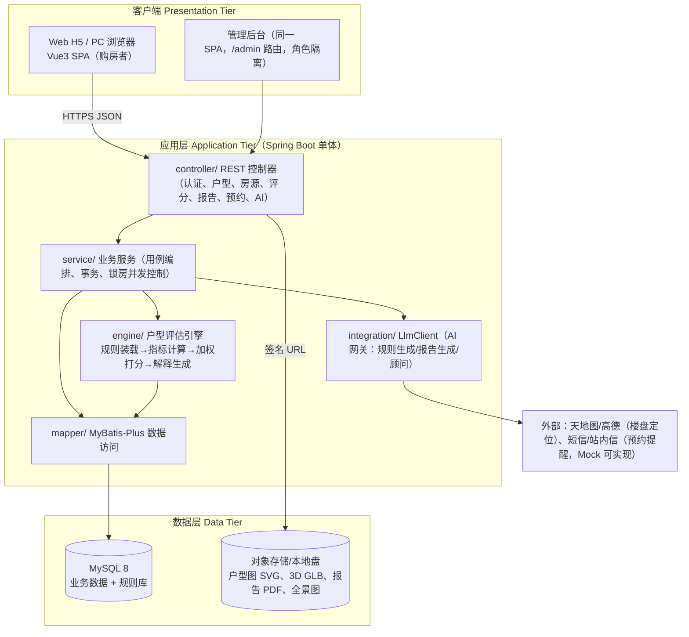

# 全局技术方案 plan.md（Spec → 实现的总转换）

> 本文件是"结构化设计"视角的**总体设计（概要设计）技术蓝本**；`docs/03-概要设计` 引用本文件并把
> 数据流图映射为软件结构图。各功能域的实现细节在 `specs/NNN/plan.md`。

## 1. 技术选型与理由（对应宪法第六条"简洁可移植"）

| 层次 | 选型 | 版本 | 选择理由（含答辩价值） |
| --- | --- | --- | --- |
| 前端 | Vue 3 + Vite + TypeScript + Pinia + Vue Router | 3.4 / 5.x | 组件化便于讲"模块独立性"；生态里有现成 2D 户型渲染与 Three.js 封装 |
| UI 库 | Element Plus | 2.7 | 学生项目免设计成本，表单/表格/步骤条齐全 |
| 图形 | Canvas 2D 户型图 + Three.js（3D 盒体）+ ECharts（雷达/得分条） | — | 满足"2D/3D 展示、全景查看、评分明细可视化" |
| 后端 | Java + Spring Boot（Web/Validation/Scheduler/Security） | 17 / 3.2 | 课程主授语言，分层清晰易画结构图 |
| 持久层 | MyBatis-Plus + MySQL | 3.5 / 8.0 | 减少模板 SQL，聚焦业务；MySQL 学校机房可用 |
| 缓存/会话 | 进程内 Caffeine + JWT（无状态） | — | 不引入 Redis，降低部署复杂度 |
| 规则引擎 | **自研 JSON 驱动打分 DSL**（不外购 Drools） | — | 创新点 I1 的落点：规则可外置、可热更新、可由 LLM 生成后人工校验 |
| 大模型 | 通义千问 / DeepSeek OpenAI 兼容接口，统一 `LlmClient` 网关 | — | AI 创新点 I1-I4；带超时+Mock 降级（宪法 4.6） |
| 文档/契约 | OpenAPI 3（SpringDoc）、Mermaid 图 | — | 图表入库可评审，报告直接引用源码 |
| 构建/质量 | Maven、JUnit 5、JaCoCo、ESLint | — | 满足宪法第四条测试门禁 |

**明确不用**：微服务、消息队列、K8s、真实支付、区块链、MyBatis 二级缓存（超出课程需要，宪法第六条）。

## 2. 系统总体架构（分层 + 分域）



**分域包结构**（与 `specs/` 一一对应，宪法第八条"包结构 1:1"）：

```
com.zhq.haofangzi
├── common/       ApiResponse、异常、分页、审计、脱敏工具
├── config/       Security(CORS/JWT)、MyBatis、OpenAPI、Scheduler、Caffeine
├── controller/   AuthController · HouseTypeController · HouseController
│                 · EvaluationController · ReportController · AppointmentController · AiController
├── service/      impl 同名服务
├── domain/       entity（表映射）· dto（入出参 Cmd/Query/VO）· enums
├── engine/       ScoringEngine · RuleRepository · MetricCalculator(接口) · metric/*（7 类指标实现）
├── mapper/       MyBatis-Plus BaseMapper 子接口
└── integration/  LlmClient(接口) · DashScopeLlmClient · MockLlmClient · MapGeoClient
```

## 3. 跨域约定

### 3.1 统一响应与错误码

```java
{ "code": 0, "message": "OK", "traceId": "…", "data": … }        // 成功
{ "code": 40410, "message": "房源不存在", "traceId": "…", "data": null } // 失败
```

| 段 | 含义 | 示例 |
| --- | --- | --- |
| 0 | 成功 | 0 |
| 400xx | 参数/校验 | 40001 分页超限 |
| 401xx/403xx | 认证/鉴权 | 40101 未登录、40302 无权限 |
| 404xx | 资源不存在 | 40410 房源、40420 户型 |
| 409xx | 业务冲突 | 40910 房源已被锁定、40920 规则版本冲突 |
| 5xxxx | 服务端/AI | 50001 内部错误、50310 AI 降级（data 仍有模板结果） |

### 3.2 鉴权与角色

- JWT（HS256，2h）+ `role` claim；角色 `BUYER` / `CONSULTANT` / `ADMIN`。
- 拦截式授权：写接口 `@PreAuthorize`；房源锁、评分规则维护、预约审批分别归 003/004/006。
- 分享链接走 `share_token`（只读、随机、默认 7 天过期），不过 JWT。

### 3.3 并发与一致性（两处关键）

1. **模拟选房锁房**（003）：`SELECT … FOR UPDATE` + `sale_status` 状态机 + 唯一索引
   `uk_house_lock(house_id, deleted)` 兜底；锁 TTL 10 分钟，定时任务回收。
2. **评分快照**（004/005）：规则改版只新增 `version`，历史 `evaluation.detail_json` 冻结不更新。

### 3.4 AI 网关（007）

`LlmClient.generate(promptKey, payload)` → 结构化 JSON 输出（受 JSON Schema 校验）→ 落库前**必须人工确认**（规则类）
或直接展示并标注"AI 生成"（报告类）。失败链路：超时 8s → 重试 1 次 → `MockLlmClient` 模板产出
→ `code=50310` 但 `data` 可用。

## 4. 数据模型总览（详见 `specs/000-program/data-model.md`、`database/schema.sql`）

核心实体 12 张：`sys_user`、`hf_project`、`hf_building`、`hf_house_type`、`hf_room`、`hf_house`、
`hf_favorite`、`hf_house_lock`、`eval_rule_set`、`eval_rule`、`evaluation`、`compare_report`、`appointment`。
关键关系：楼盘 1:N 楼栋 1:N 房源；户型 1:N 房源；`house_type` 1:N `evaluation` N:1 `eval_rule_set` 1:N `eval_rule`。

## 5. 里程碑与分工（3-4 人，建议 4 人）

| 里程碑 | 内容 | 产出 | 责任人（建议） |
| --- | --- | --- | --- |
| M1 第 1 周 | 宪法 + 000/001/002 spec 评审、库表定稿 | specs 0-2、schema.sql | 组长 A |
| M2 第 2 周 | 需求分析定稿（DFD 0/1 层 + 数据字典）、前端骨架 | docs/02、frontend | B |
| M3 第 3 周 | 概要设计（结构图 + 数据库设计）、002/003 契约与后端骨架 | docs/03、backend 骨架 | A + C |
| M4 第 4 周 | 详细设计 + 评分引擎实现与单测 | docs/04、engine + 测试 | C |
| M5 第 5 周 | 005 对比报告 + 006 预约 + 007 AI 网关 | 三域联调 | B + D |
| M6 第 6 周 | 联调、测试、用户手册、报告合稿与答辩稿 | docs/05、docs/06、报告 | 全组（组长合稿） |

分工原则（任务书要求组长承担至少一项分析/设计/实现/撰写）：
A 组长：系统分析 + 总体设计 + 评分域实现；B：需求/数据字典 + 前端 + 对比报告域；
C：数据库设计 + 详细设计 + 打分引擎；D：预约域 + 测试 + 用户手册 + AI 集成。

## 6. 风险登记

| 风险 | 影响 | 对策 |
| --- | --- | --- |
| 户型几何数据没有真实来源 | 指标算不出，评分变摆设 | 手工建 20 套"肇庆好房子"样例户型（含 SVG + 参数），`seed-data.sql` 提供 |
| 3D 建模工作量大 | 展示模块拖后腿 | 用参数化盒体 + GLB 占位；AI 生成 Three.js 初始化代码（I4）作为加分项 |
| LLM 外网不可用 | 答辩现场卡壳 | Mock 降级 + 预生成结果缓存（宪法 4.6） |
| 规则打分被认为"太简单" | 课程分数损失 | 7 类指标 × 分档评分 + 可解释证据 + 权重灵敏度分析（图表化） |
| 组员进度不齐 | 合稿延期 | `tasks.md` 日更 + 组长 3 天一致性巡检 |
