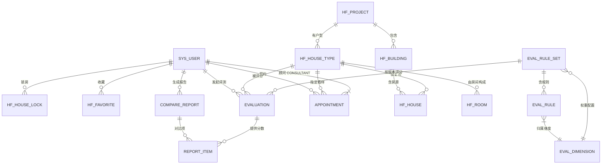

# 数据模型 data-model.md（全局逻辑设计，跨域共享）

**版本**: v1.0 | **对应**: `database/schema.sql`（物理设计）· `docs/03-概要设计` §4 数据库设计
**命名规则**: 表 `snake_case`，主键 `id BIGINT`，通用列 `created_at / updated_at / deleted`（NFR-12）

## 1. 概念模型 E-R（对应报告"概念设计"）

## 2. 逻辑设计 · 表清单与字段

### 2.1 `sys_user` 用户
| 列 | 类型 | 约束 | 说明 |
| --- | --- | --- | --- |
| id | BIGINT | PK AI | |
| phone | VARCHAR(20) | UK, not null | 登录账号 |
| password | VARCHAR(100) | not null | BCrypt 散列 |
| nickname | VARCHAR(40) | | |
| role | VARCHAR(16) | `BUYER/CONSULTANT/ADMIN` | |
| status | TINYINT | 1 正常 0 停用 | |
| budget_min / budget_max | DECIMAL(12,2) | | 总价预算（万元换算后的元） |
| family_structure | VARCHAR(32) | `SINGLE/COUPLE/FAMILY_3/FAMILY_4_2GEN/FAMILY_5_3GEN` | 家庭结构 |
| must_rooms | INT | | 最少居室数 |
| prefer_orientation | VARCHAR(32) | JSON 数组串 | 偏好朝向 |
| prefer_tags | VARCHAR(255) | JSON 数组串 | 偏好标签（学区房/地铁口/低密…） |
| consultant_id | BIGINT | FK→sys_user | 绑定顾问 |

> 画像列服务于 007 智能选房顾问（I3）输入。

### 2.2 `hf_project` 楼盘 / 2.3 `hf_building` 楼栋
`hf_project(id, name, district, address, lng, lat, developer, avg_price DECIMAL(12,2), delivery_year, tag, cover_url, summary)`
`hf_building(id, project_id FK, code, total_floor INT, units_per_floor INT, elevator_count INT, above_ground INT, south_occlusion DECIMAL(4,2) "南向遮挡角系数 0~1")`

### 2.4 `hf_house_type` 户型 **（评估主体，字段最重）**
| 列 | 类型 | 说明 |
| --- | --- | --- |
| id / project_id | BIGINT | |
| code | VARCHAR(32) UK | 如 `A1-98` |
| name | VARCHAR(64) | 建面 98㎡ 三房两厅两卫 |
| gfa / private_area | DECIMAL(8,2) | 建筑面积 / 套内面积 ㎡ |
| rooms / halls / baths | INT | 居室 / 厅 / 卫 |
| orientation | VARCHAR(16) | `S/SE/SW/N/E/W/NS`(南北) |
| bay / depth | DECIMAL(6,2) | 面宽 / 进深 m |
| ceiling_height | DECIMAL(4,2) | 净高 m |
| balcony_count | INT | 阳台数 |
| window_area | DECIMAL(8,2) | 外窗总面积 ㎡（采光计算用） |
| kitchen_area / bath_area | DECIMAL(6,2) | 厨房/主卫面积（干湿分离判定） |
| master_bedroom_area | DECIMAL(6,2) | |
| circulation_len | DECIMAL(6,2) | 主家具动线长度 m |
| corridor_ratio | DECIMAL(4,3) | 走道面积占比 |
| irratio | DECIMAL(4,3) | 异形空间占比 |
| near_road / adjacent_elevator | TINYINT | 临主干道 / 与电梯井或卫相邻（静谧） |
| green_rate | DECIMAL(4,2) | 关联楼栋绿化率 |
| plan_svg_url | VARCHAR(255) | 2D 户型图（SVG） |
| model_glb_url | VARCHAR(255) | 3D 模型 |
| pano_url | VARCHAR(255) | 720° 全景 |
| price_ref | DECIMAL(12,2) | 参考总价 |
| style / remark | VARCHAR | 精装标准、说明 |

### 2.5 `hf_room` 房间构件（支撑动线与采光明细，1 户型 : N 房间）
`hf_room(id, house_type_id FK, name, category LIVING/MASTER/SECOND/KITCHEN/BATH/BALCONY/CORRIDOR,
area, width, depth, orientation, window_area, floor_idx, x, y, w, h)` — `x/y/w/h` 供前端 Canvas 绘制与 3D 盒体生成。

### 2.6 `hf_house` 房源（销控表）
`hf_house(id, building_id FK, house_type_id FK, unit_code, floor_no, room_no, direction,
area DECIMAL(8,2), unit_price DECIMAL(12,2), total_price DECIMAL(12,2), sale_status,
view_level 视野等级, noise_level, lock_expire_at DATETIME)`
索引：`UK(house_type_id, building_id, floor_no, room_no)`，`IDX(sale_status)`。

### 2.7 行为类
- `hf_favorite(id, user_id, house_type_id, UK(user_id,house_type_id))`
- `hf_house_lock(id, house_id UK, user_id, expire_at, status ACTIVE/EXPIRED/CONVERTED/CANCELED, intention_no)`

### 2.8 评估域（5 张）
- `eval_rule_set(id, name, version, status DRAFT/PUBLISHED/OFFLINE, active TINYINT, source MANUAL/AI, note, published_at, UK(name,version))`
- `eval_dimension(id, code LIGHT/VENT/CIRC/UTIL/QUIET/GREEN/COST, name, weight DECIMAL(4,3), max_score DECIMAL(4,1), order_idx)` — 全局维度字典
- `eval_rule_set_dim(id, set_id, dimension_id, weight)` — 规则集内**可覆写**维度权重（创新点 I1 动态权重）
- `eval_rule(id, set_id, dimension_id, metric_code, metric_name, source_field, formula, operator LT/LE/GT/GE/BETWEEN/EQ/BOOL, tier_json)`
  - `tier_json` 示例：`[{"max":0.14,"score":10,"grade":"优","evidence":"窗地比≥1/7…"}]`
  - 该列即 `specs/004/contracts/scoring-rule.schema.json` 校验对象
- `evaluation(id, user_id, house_type_id, house_id NULL, set_id, set_version, total_score DECIMAL(5,2), level 优/良/中/差, detail_json, ai_note TEXT, created_at)`

### 2.9 报告与预约
- `compare_report(id, user_id, title, house_type_ids JSON, matrix_json, conclusion TEXT, ai_generated TINYINT, share_token UK, expire_at, export_url)`
- `appointment(id, user_id, consultant_id, project_id, house_type_id, house_id, visit_date DATE, visit_slot,
  party_size, contact_phone, status PENDING/CONFIRMED/ARRIVED/COMPLETED/CANCELED, audit_remark, audit_by, notified_at, created_at)`
  状态机见 `docs/diagrams/appointment-state.mmd`
- `sys_audit_log(id, user_id, action, target_type, target_id, ip, ua, extra JSON, created_at)` — NFR-06/09

## 3. 物理设计要点（对应报告 §4.3）

1. 引擎 InnoDB，字符集 `utf8mb4_0900_ai_ci`；全表软删除，唯一索引一律带 `deleted` 后缀列或业务编号加 UUID。
2. 高频查询：`hf_house` 按 `(building_id, sale_status)`、`(house_type_id, sale_status)` 复合索引；
   `hf_house_type` 按 `(gfa, rooms, orientation)` 支撑筛选；`evaluation` 按 `(user_id, created_at)`。
3. 大字段（`detail_json`、`matrix_json`）放行外页，列表查询不 `SELECT *`。
4. 金额/面积统一 `DECIMAL`，禁止 `FLOAT`；日期用 `DATETIME(0)` 存 UTC+8 本地时间（课程演示简化，报告注明）。
5. 数据量估算：房源 600、户型 20、评测记录 3 学期 × 2000 ≈ 1.2 万、规则 200 条以内 —— 单表无分库分表需求。
6. 备份：`mysqldump` 每日（演示环境），`database/seed-data.sql` 保证任意时刻可重建演示数据。

## 4. 数据完整性与并发

| 约束 | 实现 |
| --- | --- |
| 户型-房间一致 | 外键 + 保存户型时全量替换 `hf_room` 子记录（同一事务） |
| 同一房源不可重复锁定 | `hf_house_lock.house_id` 唯一索引 + `SELECT … FOR UPDATE` + TTL |
| 评分历史不可篡改 | `evaluation.detail_json` 快照；规则集 PUBLISHED 后禁止编辑，只能新版本 |
| 规则权重之和 | 保存 DRAFT 时校验 Σweight = 1.000（±0.001），不通过 40920 |
| 状态一致 | 销控/预约状态流转只在 service 层，SQL 带 `WHERE sale_status = ?` 乐观条件 |
